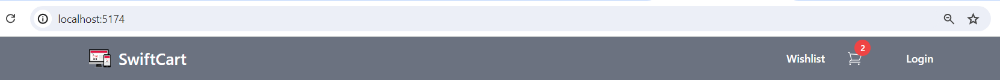
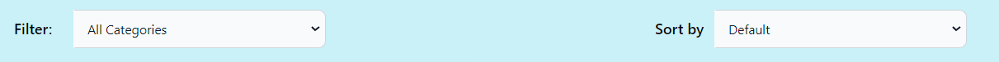
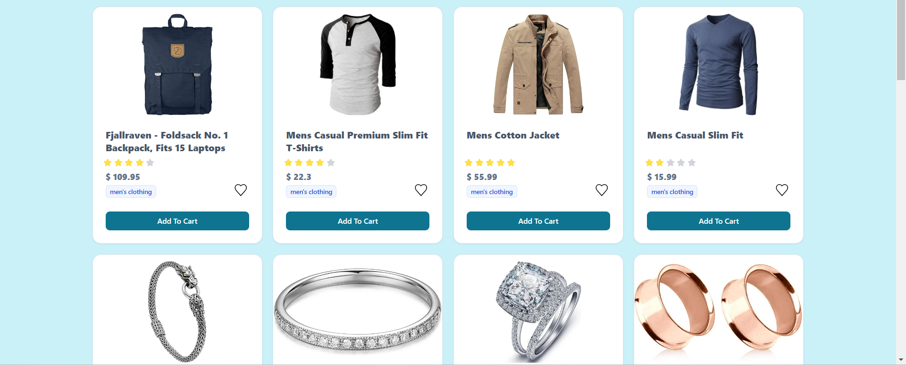
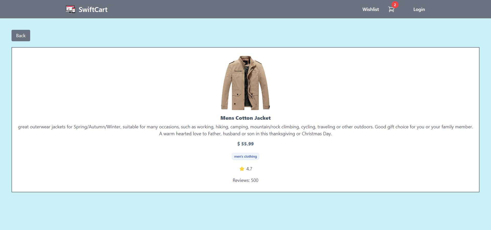

# 🏪 SVELTE CHALLENGE | JSF 02 👔

## Introduction
In this project, I built an e-commerce application to test my skills with Svelte. This shopping application is designed to provide a fast and efficient shopping experience for users. With Svelte’s fast updates and smart code handling, I was able to make the browsing smooth, the loading quick, and the design attractive. This made the user experience much better.

## 🤖 Technologies
I used the following technologies for my SwiftCart app
- HTML: For the structure of the components & pages.
- CSS3: Styling the web pages, using Tailwind CSS for utility-first CSS framework.
- JavaScript: To handle logic, interactions, and API calls.
- Svelte: Framework for building the app's user interface with a reactive and component-based approach.
- Svelte Stores: For state management, using writable or readable stores to handle data like product lists & applied filters.
- Vite: A build tool for fast development and efficient bundling of the Svelte application
- Fakestore API: A free API for e-commerce products.

## Setup Instructions
1. Clone the Repository & Open Terminal
2. Install Dependencies: `npm install`
3. Run the Development Server: `npm run dev`
4. Follow Link to view live app

## Usage Examples
### Home Page
Users can Navigate to the Home page by clicking on the Logo which will display a grid of products available on the app.

### Filter by Category & Sort by Price
Filtering and sorting options are provided to help users find the products they need: Select a category from the "Filter" dropdown menu to display products from that category only & Choose an option from the "Sort by" dropdown to sort products by price, either from low to high, high to low and both include default options.

### Viewing Product Details
Click on each product card to view detailed information about the product, including its image, title, price, category, rating, and description. The product details are displayed in a Products Detail page. For a seamless user experience, a back button is added to navigate to the Home page.

